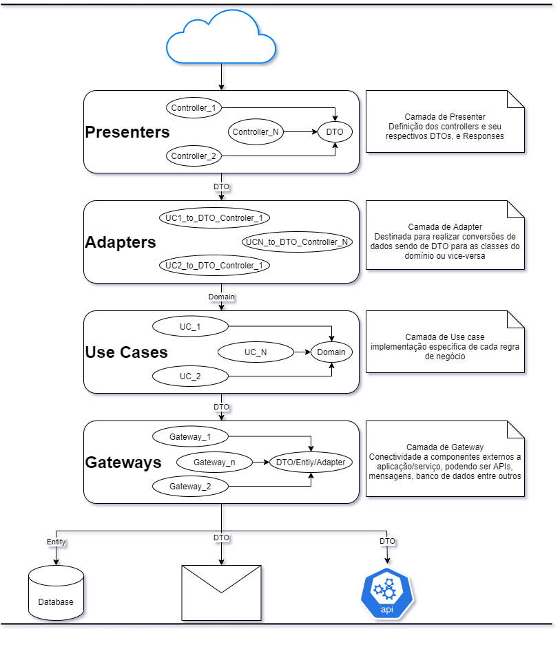
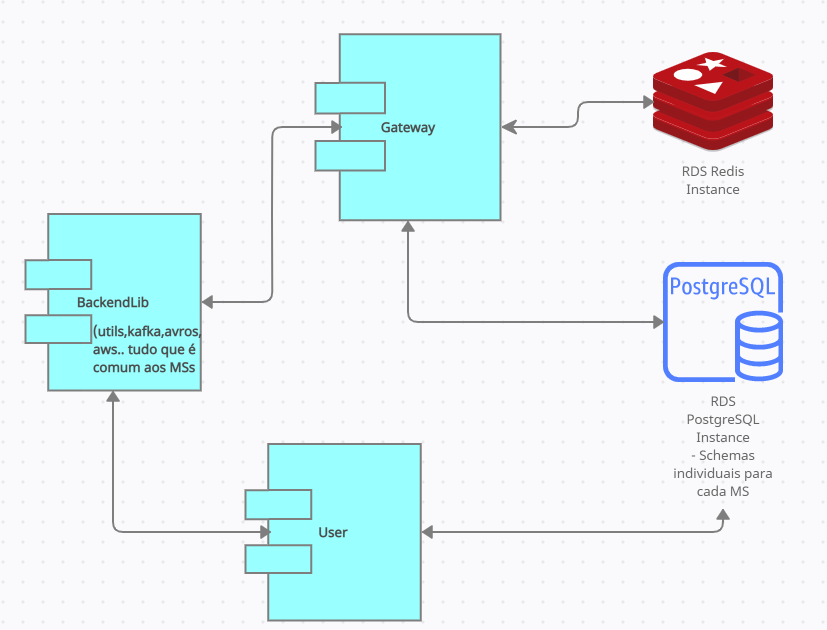

### Tecnologias utilizadas

### Diagrama arquitetural

###Diagrama arquitetural (em construção)

### Orientações gerais:
 
1 ) Nome de classes, interfaces, enums, variáveis, métodos, JavaDOC, swagger, etc, manter e criar na lingua inglesa.

2 ) Usar JavaDOC para todas as classes contendo a descrição do seu propósito.

3 ) Usar JavaDOC para todos os métodos, contendo: descrição, parâmetros, retorno e exeções quando existir.

4 ) Toda e qualquer classe tem que obrigatóriamente implementar uma interface que sinaliza seu contrato.

5 ) Para injeção de componentes do spring apenas declarar como private a interface do componente desejado e anotar a classe do componente atual com `@AllArgsConstructor` do [Lombok](https://projectlombok.org/).

6 ) Testes unitários com cobertura miníma de 80% sob todo e qualquer fonte alterado.

7 ) Usar [Lombok](https://projectlombok.org/) para criação de métodos padrões como get, set, construtor, tostring, etc.

8 ) Executar verificação do sonar localmente antes de qualquer commit no repositório.

9 ) Aplicar conceito do [Clean code](https://www.hostgator.com.br/blog/clean-code-o-que-e/) nos fontes. Algumas dicas gerais abaixo:
* Imports staticos declarados antes dos imports comuns
* Nome de variável não se deve iniciar com caracter especial, número ou letra maiúscula
* Abertura de chaves na linha do método e/ou instrução
* Uma linha em branco entre operações, métodos ou variáveis
* Não haver linhas em branco no começo e no final dos métodos
* Número máximo de variáveis de parametros em uma método: 5. Usar uma classe builder para controlar os parametros após isso
* Preferência por métodos pequenos, métodos com mais de 50 linhas já tem uma grande chance de serem complexos

### Configuração de ambiente DEV
* #### IntelliJ
	* Instalar o plugin do sonarlint 
		* Sincronizar com a regras padrões do sonarqube
* #### Eclipse
	* Instalar o plugin do loombok 
	* Instalar o plugin do sonarlint
		* Sincronizar com a regras padrões do sonarqube

### Configurando application-dev.yml
Basta configurar a seguinte variável de ambiente na JVM
`spring.profiles.active=dev`
Na IDE basta editar as configurações de inicialização da aplicação.

### Inicializando o wiremock
Para inicializar o servidor de mock basta executar o arquivo da pasta:
`mocks/start.sh`

### Padrões de desenvolvimento
* #### Geral:
	* Nome de método privado: breve descrição da função na lingua inglesa. Ex.: `searchHistory`
	* Nome do pacote deve ser iniciado com `br.com.openbanking.creditcards`
	* Toda variável nas classes devem ser privadas
	* Toda e qualquer injeção de componentes e serviços devem ser feitas a nível de interface. Ex.: `private MyInterface myComponent` <- Correto | `private MyInterfaceImpl myComponent` <- Errado
	* Toda e qualquer configuração que necessite de URL utiliza uma variável criada no arquivo `.yml` para definição dela:
		* Segue o padrão da variável: `gateway.[NomeDoServiço].url`. Ex.: `gateway.receivings.url`
* #### Camadas:
	* ##### Configurations:
		* Nome da classe de configuração: `[NomeDoComponente]Configuration`. Ex.: `SwaggerConfiguration`
		* Classe de configuração anotado com:
			* `@Configuration`
		* Método público anotado com:
			* `@Bean`
	* ##### Presenters:
		* Controller:
			* Toda classe de controller implementa uma interface que define sua assinatura
			* Sequência do nome do pacote para interfaces `[...].presenter.entrypoint.rest`
			* Sequência do nome do pacote para classes `[...].presenter.entrypoint.rest.impl`		
			* Nome da interface: `[API]Controller`. Ex.: `MyAPIController`
			* Nome da classe: `[API]ControllerImpl`. Ex.: `MyAPIControllerImpl`
			* Nome do método: `[Ação][Recurso]`. Ex.: `GetMyResource(dto...)`, `PostOtherResource(dto...)`
			* Classe anotada com:
				* `@RestController`
				* `@RequestMapping(...)`
				* `@RequiredArgsConstructor`
			* Método anotado com:
				* `@Cacheable(...)`
				* `@Operation(...)`
				* `@ApiResponse(responseCode = "200", description = "Success")`
				* Se a ação for `GET`:
					* `@GetMapping(..., produces = MediaType.APPLICATION_JSON_VALUE)`
				* Se a ação for `POST`:
					* `@PostMapping(..., produces = MediaType.APPLICATION_JSON_VALUE)`
			* Validações de parametros/requests e respostas/responses devem ser feitas com os recursos da linguagem e do framework:
				* [Java Bean Validation Basics](https://www.baeldung.com/javax-validation),
				* [Validating RequestParams and PathVariables in Spring](https://www.baeldung.com/spring-validate-requestparam-pathvariable)
		* DTO:
			* Sequência do nome do pacote para classes e sub classes `[...].presenter.entrypoint.dto`
			* Sequência do nome do pacote para enumerações `[...].presenter.entrypoint.dto.enumerations`
			* Nome da classe: `[Assunto]Dto`. Ex.: `AccountDto`
			* Nome da subClasse: `[Assunto]`. Ex.: `DetailAccount`
			* Nome de enumerações: `[Assunto]Enum`. Ex.: `TypeEnum`
			* Nome da classe de resposta/retorno da API/Recurso: `[Recurso]Response`. Ex.: `ResourceResponse`
			* Classe anotada com:
				* `@AllArgsConstructor`
				* `@NoArgsConstructor`
				* `@Builder`
				* `@Data`
		* Intercepter Handler:
			* Sequência do nome do pacote `[...].presenter.entrypoint.[typeIntercepter]`
			* Nome da interface: `[TypeIntercepter]Handler`. Ex.: `TypeIntercepterHandler`
			* Nome da classe: `[API]HandlerImpl`. Ex.: `TypeIntercepterHandlerImpl`
	* ##### Adapters
		* Adapter:
			* Sequência do nome do pacote `[...].presenter.entrypoint.[typeIntercepter]`
			* Nome da classe: `[ObjetoResposta]Adapter`. Ex.: `AccountAdapter`, `DetailAdapter`
			* Nome do método público: `convert`. Obs.: Nome do método é o mesmo para todas os overloads
			* Todo e qualquer método é estático
			* Classe anotada com:
				* `@UtilityClass`
	* ##### Uses Cases:
		* UseCase:
			* Toda classe de use case implementa uma interface que define sua assinatura
			* Interfaces por recurso de API criada para definir a assinatura única dos casos de uso daquela jornada, tendo como parametro e retorno o DTO de response do recurso. Ex.: `public AccountResponse execute(AccountResponse response) { ... }`
			* Sub use case está livres para definir a assinatura da sua interface
			* Sequência do nome do pacote da interface `[...].usecase.[NomeDaAPI]` . Ex.: `br.com.openbanking.creditcards.usecase.myapi`
			* Sequência do nome do pacote da classe dos use case `[...].usecase.[NomeDaAPI].impl` . Ex.: `br.com.openbanking.creditcards.usecase.myapi.impl`
			* Nome da interface do recurso da API: `[NomeDoRecurso]UseCase`. Ex.: `MyResourceUseCase`
			* Nome da interface dos sub use case: `[BreveDescricao]UseCase`. Ex.: `SumaryValuesUseCase`
			* Nome da classe: `[BreveDescricao]UseCaseImpl`. Ex.: `SearchCardLimitsUseCaseImpl`
			* Nome do método público definido na interface: `execute`
			* Classe anotada com:
				* `@Service(value = "[BreveDescricao]UseCase"). Ex.: @Service(value = "searchCardLimitsUseCase")`
				* `@RequiredArgsConstructor`
		* Domain:
			* Sequência do nome do pacote para classes `[...].usecase.domain`
			* Sequência do nome do pacote para enumerações `[...].usecase.domain.enumerations`
			* Nome da classe: `[Assunto]`. Ex.: `Account`
			* Nome de enumerações: `[Assunto]Enum`. Ex.: `TypeEnum`
			* Classe anotada com:
				* `@AllArgsConstructor`
				* `@NoArgsConstructor`
				* `@Builder`
				* `@Data`
	* ##### Gateways:
		* Sub-dividido em:
			* Client:
				* Sequência do nome do pacote para interfaces `[...].external.gateways.[NomeDoServico].client` .Ex.: `br.com.openbanking.creditcards.external.gateways.coredigital.client`
				* Sequência do nome do pacote para classes `[...].external.gateways.[NomeDoServico].client` .Ex.: `br.com.openbanking.creditcards.external.gateways.coredigital.client.impl`
				* Nome da interface: `[NomeDaApi]Client`. Ex.: `AccountsClient`, `CreditCardsClient`
				* Nome da classe: `[NomeDaApi]ClientImpl`. Ex.: `AccountsClientImpl`, `CreditCardsClientImpl`
				* Nome do método publico: `[Ação][NomeDoRecurso]`. Ex.: `getAccounts`, `getBills`, `postConsentedAccount`
				* Método publico tem como parametro o `RequestDto` e retorna apenas o Response do eecurso solicitado, não há transformação ou agrupamento(listas) de respostas. Ex.: `public BillsResponse getBills(BiilsRequestDto request) { ... }`
				* Tipo de REST client:
					* Feign Client:
						* [Feign Client DOC](https://cloud.spring.io/spring-cloud-openfeign/)
						* Interface anotada com:
							* `@FeignClient(...)`
						* Método anotado com:
							* Se for `GET`:
								* `@GetMapping (...)`
							* Se for `POST`:
								* `@PostMapping (...)`
					* WebFlux:
						* [WebFlux](https://docs.spring.io/spring-framework/docs/current/reference/html/web-reactive.html)
						* Todo método retorna um `Mono` do Response do recurso solicitado. Ex.: `public Mono<MyResponse> getLimits(...) { ... }`
						* Classe anotada com:
							* `@Service`
						* Construtor público obrigatório com os seguintes parametros:
							* `org.springframework.web.reactive.function.client.WebClient.Builder webClientBuilder`
							* `@Value("${gateway.[NomeDoServiço].url}") String url`
			* Serviços/Componentes/Gateways:
				* Utilizam o client criado para comunicação com o serviço externo
				* Sequência do nome do pacote para interfaces `[...].external.gateways.[NomeDoServico]` .Ex.: `br.com.openbanking.creditcards.external.gateways.coredigital`
				* Sequência do nome do pacote para classes `[...].external.gateways.[NomeDoServico].impl` .Ex.: `br.com.openbanking.creditcards.external.gateways.coredigital.impl`
				* Nome da interface: `[NomeDaApi]Gateway`. Ex.: `AccountsGateway`, `CreditCardsGateway`
				* Nome da classe: `[NomeDaApi]GatewayImpl`. Ex.: `AccountsGatewayImpl`, `CreditCardsGatewayImpl`
				* Nome do método publico:
					* Se for uma única resposta:
						* `[Ação][NomeDoRecurso]`. Ex.: `getAccounts`, `getBills`, `postConsentedAccount`
					* Se for um agrupamento(lista) de respostas:
						* `[Ação][NomeDoRecurso]List`. Ex.: `getAccountsList`, `getBillsList`, `postConsentedAccountList`
				* Classe anotada com:
					* `@Service`
					* `@RequiredArgsConstructor`
* #### Classes utilitárias
	* Sequência do nome do pacote `[...].utils`
		* Nome da classe: `[BreveDescrição]Utils`. Ex.: `ConvertUtils`, `MessageUtils`
		* Todo e qualquer método é estático
		* Classe anotada com:
			* `@UtilityClass`
* #### Classes de constantes
	* Sequência do nome do pacote `[...].constants`
		* Nome da classe: `[BreveDescrição]Constants`. Ex.: `ConvertConstants`, `MessageConstants`
		* Não há métodos, apenas variáveis
		* Toda variável é publica, final e estática. Ex.: `public final static String CONST_VAR = "Value"`
		* Classe anotada com:
			* `@UtilityClass`
* #### Logs:
   * Utilize a anotação `@Slf4j` do lombok para gerar uma instancia de "log" na classe.
   * Toda captura de exceção deve obrigatóriamente realizar o log da mesma a nivel de `ERROR`
   * Todo log adicional deve ser a nível de `DEBUG`
* #### Testes
	* ##### Geral: 
		* Nome do pacote ser o mesmo do nome do pacote da classe que está sendo testada
		* Nome da classe de testes deve ser o nome da classe testada mais um sufixo Test. Ex.: `MyUsecaseImpl`, `MyUsecaseImplTest`
		* Nome dos métodos de testes iniciarem com o prefixo test. Ex.: `testSearchDates`
		* Toda classe de testes deve ter o JavaDoc descrevendo oque está sendo testado
		* Simulação/build/montagem de DTO devesse criar uma classe auxiliar de builder sendo:
			* Nome do pacote `br.com.openbanking.creditcards.utils`
			* Nome da classe: `[NomeDoRecurso]Util`. Ex.: `BillsUtil`
			* Nome dos métodos:
				* Quando for um único DTO: `build[ResponseOuRequest]`. Ex.: `buildRequest, `buildResponse`
				* Quando for uma lista de DTO: `build[ResponseOuRequest]List`. Ex.: `buildRequestList, `buildResponseList`
	* ##### Asserts
		* Importar os asserts de modo estático. Ex.: `import static org.junit.jupiter.api.Assertions.assertEquals`
		* Comparação de valores primitivos utilizar os asserts da classe `Assertions` do `Jupiter`. Disponível em `org.junit.jupiter.api.Assertions`
		* Comparação de estruturas utilizar os asserts da classe `Assertions` do `Assertj-Core`. Disponível em import static `org.assertj.core.api.Assertions`
		* Verificar iteração com métodos que não há retorno utilizar o `verify` do `Mockito`. Disponível em `org.mockito.Mockito`
	* ##### Unitários:
		* Instanciar com o contrutor da classe que está sendo testada, passar como parametro os demais componentes dependentes. Ex.: `MyUsecase useCase = new MyUsecase(gatewayX, gatewayY, ...)`
		* Realizar a contrução da classe testada em um método anotado com `@BeforeAll`
		* Utilizar [Mockito](https://site.mockito.org/) para simular/mockar os componentes que não são o componente/classe testada
	* ##### Componentes/Integração
		* Anotar a classe com `@SpringBootTest` para levantar a aplicação em modo de teste para serem injetados todos os componentes
		* Utilizar Rest assured para response de request
		* Simular retornos da camada de gateway com:
			* Mockito
			* Wiremock: utilizar os arquivos de simulação dentro da pasta de resources(test/recources)